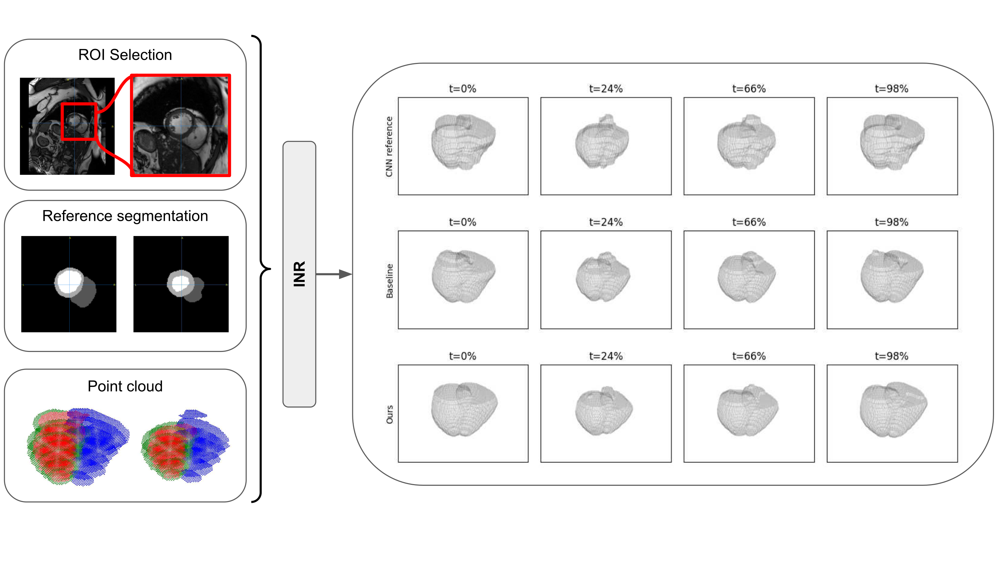

# NIMOSEF - v1

Official implementation of the MICCAI 2025 paper:

**NIMOSEF: Neural Implicit Motion and Segmentation Functions**  
📄 [MICCAI Proceedings](https://papers.miccai.org/miccai-2025/0638-Paper4418.html)

---

## About

NIMOSEF is a unified framework that leverages **implicit neural representations (INRs)** for **joint segmentation, intensity reconstruction, and displacement field estimation**, evaluated in cardiac MRI 2D SAX images.



---

## Status

🕐 The code is currently being prepared and will be uploaded soon.  
✅ Repository name and structure are stable. Please check back soon.

---

We recommend using **conda** with Python 3.10.  
- You can install dependencies via `install_gpu.sh`.  
- Alternatively, build the provided `Dockerfile`.  

Key dependencies: **PyTorch**, **DGL**, **pytorch3d**.  

---
## Expected Data Structure

NIMOSEF assumes a **BIDS-like structure** with `sub-*` subjects and `derivatives/` folders:

<pre>DATASET_ROOT/
├── sub-0001/
│ └── anat/
│ │ └── sub-0001_img-short_axis_tp-2.nii.gz
├── derivatives/
│ ├── sa_segmentation/
│ │ └── sub-0001/sub-0001_sa_seg_all_corrected.nii.gz
│ │ └── sub-0001/sub-0001_sa_seg.nii.gz
│ ├── sa_coordinates/
│ │ └── sub-0001/sa_axis_affine.tfm
│ │ └── sub-0001/sa_axis_transform.tfm
│ └── sa_roi/ (optional)
│ │ └── sub-0001/sub-0001_sa.nii.gz
</pre>

- `sa_roi/` contains cropped ROI short-axis images, aligned with `*_sa_seg.nii.gz`.  
- `*_sa_seg_all_corrected.nii.gz` is the segmentation of the original (non-ROI) image.  
- `sa_coordinates/` contains affine transforms (`.tfm`) and local-axis transforms.  
  Each subject’s local axis is defined by LV→RV (short axis), apex→base (long axis), and their cross-product.  

The preprocessing scripts can be adapted to change the expected filenames and folders.
During preprocessing, additional folders are generated (default names):  

- `derivatives/implicit/` → parquet + npz arrays  
- `derivatives/manifests_nimosef/` → subject manifests + dataset splits  
- `derivatives/nimosef_v1/` → training runs, checkpoints, logs  
- `derivatives/nimosef_v1_results/` → result outputs  

---

## Quick Start

### 1. Preprocess data

Convert raw NIfTI into parquet + manifests:

```bash
python -m nimosef.data.preprocess_data \
  --root /path/to/dataset \
  --patients -1 \
  --save-dir implicit \
  --manifest-dir manifests_nimosef \
  --use-roi
```


By default, splits are automatically generated taking 0.70 for training, 0.15 for validation and 0.15 for test. You can re-run the split generation script (`nimosef.data.generate_splits`) to create a new `dataset_manifest.json`.
Then a dataset can be loaded as:


```bash
from nimosef.data.dataset import NiftiDataset, nifti_collate_fn
from torch.utils.data import DataLoader

split_file = dataset_path/derivatives/manifests_nimosef/dataset_manifest.json
mode = "train"

dataset = NiftiDataset(split_file, mode=mode)
train_loader = DataLoader(train_set, batch_size=2, shuffle=True, collate_fn=nifti_collate_fn)

```

## 2. Train

For a reference implementation, see ```tests/run_train.py```
Example minimal bash script with default parameters:

```bash
data_path=/path/to/dataset
save_folder=${data_path}/derivatives/nimosef_v1
manifest_file=${data_path}/derivatives/manifests_nimosef/dataset_manifest.json

python -m nimosef.training.train \
    --data_folder ${data_path} \
    --split_file ${manifest_file} \
    --save_folder ${save_folder} \
    --batch_size 1 \
    --prefetch_factor 2 \
    --num_workers 4 \
    --num_epochs 1000 \
    --epochs_to_evaluate_validation 250 \
    --validation_epochs 100
```

You can also load configs from YAML files such as the ones available in the `config/` folder as shown in the `scripts/` examples.

The training can be monitored with TensorBoard:

```bash
tensorboard --logdir /path/to/dataset/derivatives/nimosef_v1 --port 6006
```

---

## 3. Inference

Example bash script:

```bash
data_path=/path/to/dataset
save_folder=${data_path}/derivatives/nimosef_v1
model_path=${save_folder}/experiment_20250907_183826/checkpoint_last.pth

python -m nimosef.training.inference \
    --data_folder ${data_path} \
    --split_file ${data_path}/derivatives/manifests_nimosef/dataset_manifest.json \
    --save_folder ${save_folder} \
    --initial_model_path ${model_path}
```

For a reference implementation, see ```tests/run_inference.py```

## 4. Generate results

Reconstruct outputs:

```bash
results_folder=/path/to/dataset/derivatives/nimosef_v1_results

python -m nimosef.training.generate_results \
    --data_folder /path/to/dataset \
    --split_file /path/to/dataset/derivatives/manifests_nimosef/dataset_manifest.json \
    --mode train \
    --model_to_rec ${model_path} \
    --save_rec_folders ${results_folder} \
    --res_factor_z 1.0 \
    --overwrite_imgs True    
```
For higher resolution you can modify the `res_factor_z` to `2.0` for example.
Additional scripts in `nimosef.analysis` allow computing shape-code distances and mean reconstructions.

# Generated Files

- `{id}_rec.nii.gz`	Reconstructed 4D MR intensity volume (model’s prediction).
- `{id}_seg.nii.gz`	Predicted 4D segmentation volume (per time frame).
- `{id}_seg_gt.nii.gz`	Ground-truth segmentation (if available).
- `{id}_im_gt.nii.gz`	Ground-truth intensity image (if available).
- `{id}_pred_boundaries.parquet`	Boundary point coordinates (x, y, z, t) predicted by the model. Useful for shape tracking.
- `{id}_true_boundaries.parquet`	Ground-truth boundary points (if available).
- `{id}_displacement.parquet`	Predicted displacement vectors at boundary points. Encodes motion across time.

## 5. Visualization

Scripts in `nimosef.visualization` reproduce plots as in the paper (volume curves, feature importance, displacement fields).

Example figures and animations will be available in the docs/ folder:
- `overview.png` → pipeline overview
- `motion.gif` → example temporal segmentation + motion trajectories

# How to Use the Outputs

- Visualize reconstructed MR: load `*_rec.nii.gz` in FSLeyes or ITK-SNAP.
- Evaluate segmentation: compare `*_seg.nii.gz` vs `*_seg_gt.nii.gz` (Dice, Hausdorff, volume metrics). See `losses/get_average_metrics.py`.
- Analyze motion fields: use `{id}_pred/true_boundaries.parquet` to reconstruct boundary trajectories, this let you track LV/RV surfaces across time without voxelization.
  - Columns: (x, y, z, time) = locations

This means:
- Voxel-wise predictions are stored in NIfTI files (`.nii.gz`).
- Geometry-aware analyses are stored in `.parquet` boundary files.

## Citation

If you use or refer to NIMOSEF, please cite:

@InProceedings{BanJau_NIMOSEF_MICCAI2025,
        author = { Banus, Jaume and Delaloye, Antoine and M. Gordaliza, Pedro and Georgantas, Costa and B. van Heeswijk, Ruud and Richiardi, Jonas},
        title = { { NIMOSEF: Neural implicit motion and segmentation functions } },
        booktitle = {proceedings of Medical Image Computing and Computer Assisted Intervention -- MICCAI 2025},
        year = {2025},
        publisher = {Springer Nature Switzerland},
        volume = {LNCS 15970},
        month = {September},

}